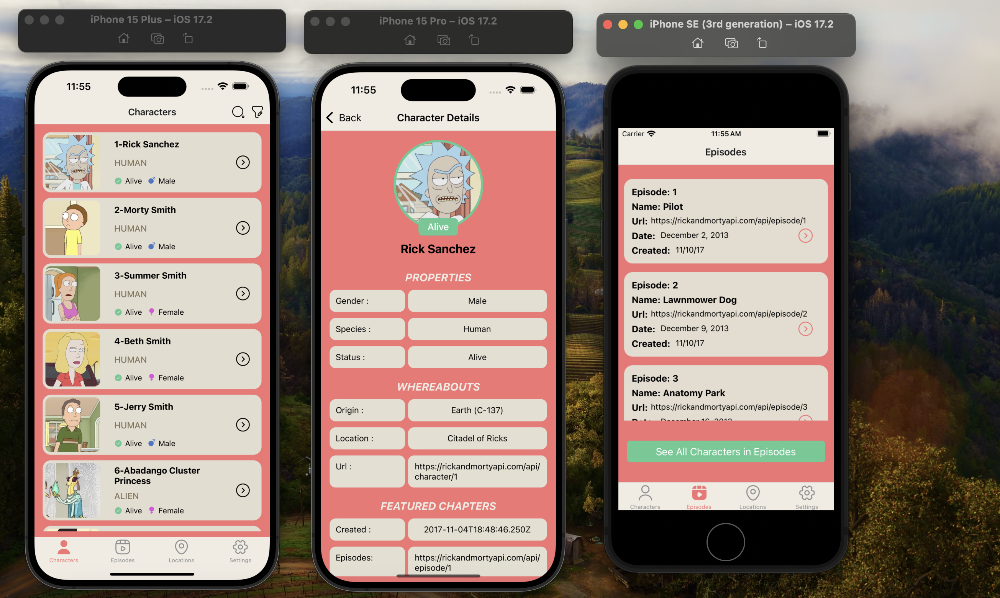
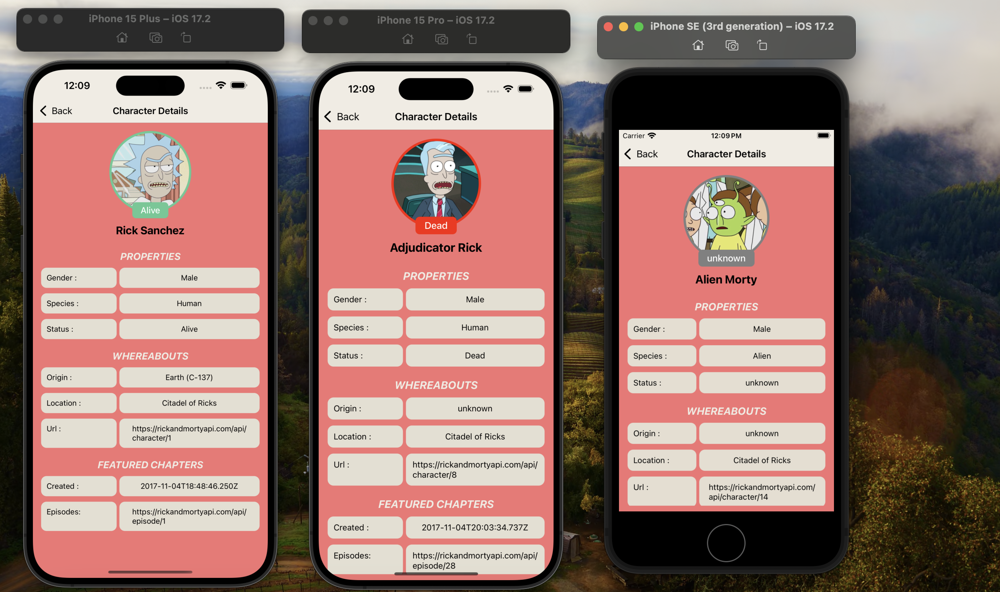
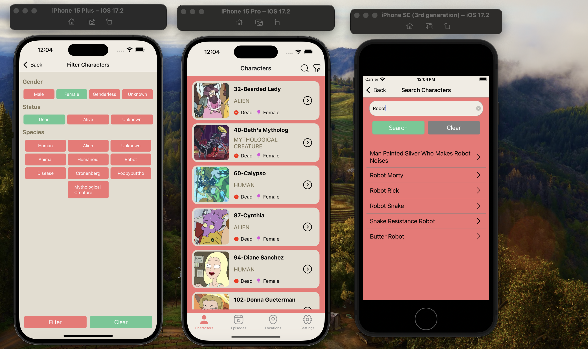
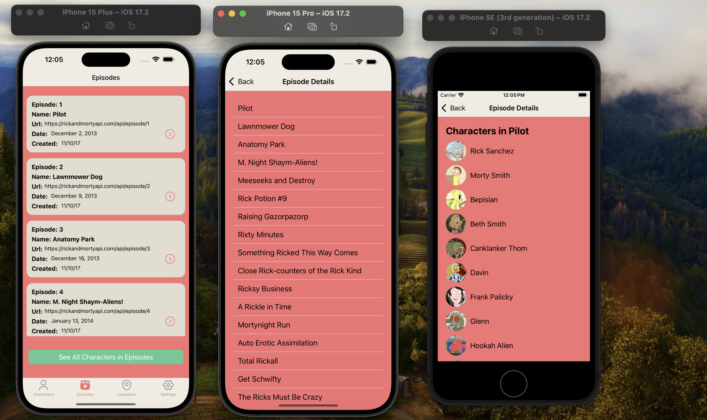
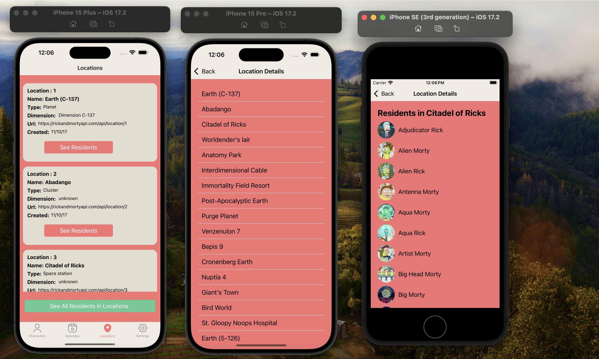

# Rick and Morty API React Native Application

This project is a React Native application developed using the Rick and Morty API. It features pages for characters, episodes, and locations from the series. Below, you can find details about the project and the technologies used.

# Features

- Characters Page: Displays a list of characters retrieved from the API.
- Episodes Page: Shows episodes from the Rick and Morty series.
- Locations Page: Lists various locations featured in the series.

# SCREEN GIF

# SCREEN VIEW

# Used Libraries

- react-navigation/bottom-tabs: Used for navigation and tab management.
- react-navigation/native-stack: Manages the navigation stack.
- axios: Used for making HTTP requests and communicating with the API.
- iconsax-react-native: Provides visual icons.
- react-redux: Used for state management with Redux.
- redux-thunk: Middleware for managing async logic with Redux.

# Special Functions

- Search Characters: Allows searching characters by name on the characters page.
- Filtering: On the filtering page, characters can be filtered by attributes such as gender, status, and species.
- Redux State Management: Centralized state management is achieved throughout the application using Redux.

# Usage

Once the application is running, use the navigation tabs on the main screen to navigate between different pages. You can use the search icon on the characters page to find specific characters or utilize the filtering options on the filtering page to list characters based on specific attributes(gender,status or species).
